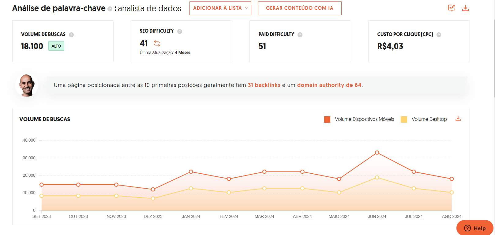
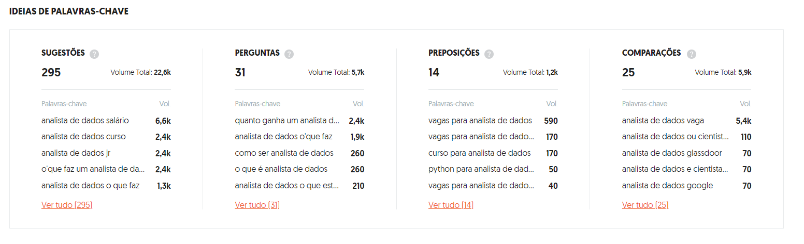
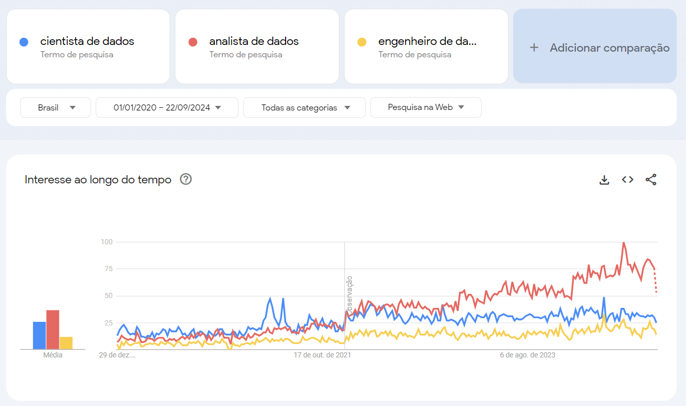
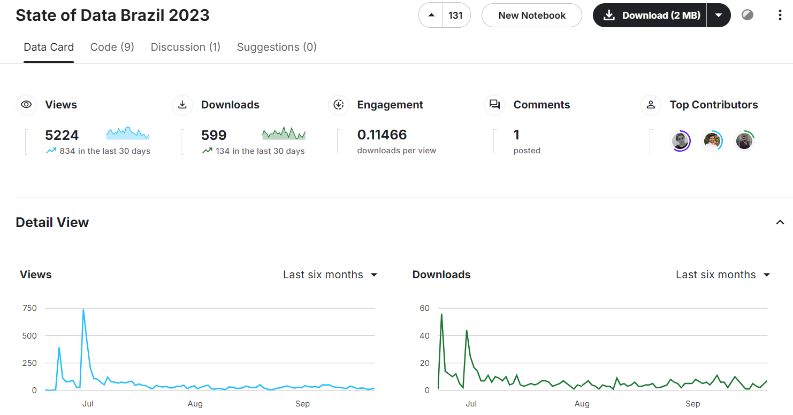
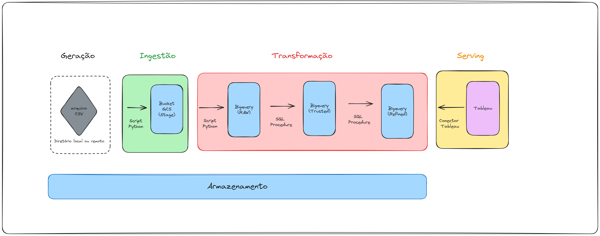

# Indice

- [Contexto](#-contexto)
- [Oportunidade](#-oportunidade)
- [Proposta](#-proposta)
- [KPIS](#-KPIS)
- [Ferramentas](#-ferramentas)
- [Arquitetura](#-arquitetura)
- [Cronograma](#-cronograma)

 

# 🪶 Contexto

Desde 2021, a comunidade Data Hackers e a Bain Company vêm desenvolvendo uma pesquisa com foco em obter um raio-X do mercado de dados. O relatório é disponibilizado em formato PDF para organizações e profissionais ao acessarem o [site](https://stateofdata.datahackers.com.br/). Além disso, eles estimulam a comunidade de dados a desenvolver suas próprias análises, disponibilizando o dataset no [Kaggle](https://www.kaggle.com/datasets/datahackers/state-of-data-brazil-2023/data).

A última pesquisa, realizada no ano de 2023, reuniu 5.293 respostas com indicadores sobre perfil demográfico, formação, conhecimentos necessários para atuação na área, remuneração e muito mais.

 

# 🔎 Oportunidade
Existe um interesse crescente no mercado de trabalho por vagas na área de dados, onde um dos principais fatores de motivação é o salário médio inicial, considerado acima da média em comparação a profissões tradicionais.

O fato é que muitas pessoas estão buscando uma oportunidade para entrar no mercado de dados, seja vindo de uma transição de carreira mais consolidada ou iniciando uma nova, e **não sabem qual o melhor caminho a seguir**.

Mesmo com fontes de dados disponíveis como o relatório do State of Data Brazil, o público em transição acaba não consumindo esses dados como fonte primária para a tomada de decisão.

 

*
 Legenda: Análise de Palavras Chaves no Ubbersugest e Google Trends 
*

 

# 👨🏾‍💻 Proposta
Pensando em solucionar esse problema e trazer uma orientação para quem está ingressando no mercado, com um recorte para a profissão de analista de dados, uma das mais pesquisadas nos últimos 12 meses, propõe-se o desenvolvimento de um painel interativo e acessível que sugere, com base na pesquisa do *State of Data* e na frequência das respostas, **o melhor caminho para aqueles que querem ingressar na área como Analista de Dados**.

 

# 🔑 KPIS
Como métricas de sucesso do projeto, estabeleceu-se as seguintes:

- Alcançar 1.000 acessos no Dashboard em 30 dias
- Aumentar em 10% o número de downloads da base de dados original do Kaggle em 30 dias

 

 

# 🔨 Ferramentas

- VScode
- Git/Github
- Python 3.11
- GCP (Google Cloud Storage e Bigquery)
- Figma
- Tableau

 

# 🗺️ Arquitetura
Foi planejada a seguinte arquitetura para o desenvolvimento da pipeline de dados:

 

# 📅 Cronograma 

| Atividade               |Data Prevista | Data Conclusão | Entregas |
|-------------------------|--------------|-------------|-------------|
| Discovery     | 21/09/24       | <ul><li>- [x] </li>      | - |
| Documentação Tabela camada Raw           | 05/10/24       | <ul><li>- [x] </li>    | [ Ver documentação RAW](https://github.com/FranciniSantana/state_of_data_brazil_23/blob/main/state_of_data_brazil_2023/docs/raw_tb_state_of_data_2023.md)
| Documentação Tabela camada Trusted           | 05/10/24       | <ul><li>- [x] </li>    | [Ver documentação TRUSTED](https://github.com/FranciniSantana/state_of_data_brazil_23/blob/main/state_of_data_brazil_2023/docs/trusted_tb_state_of_data_2023.md)
| ELT - Tabela camadas Stage / RAW   | 19/10/24   | <ul><li>- [ ] </li> | [Ver script ingestão Cloud Storage ](https://github.com/FranciniSantana/state_of_data_brazil_23/blob/main/state_of_data_brazil_2023/ingestion/to_storage.py) / [Ver script ingestão BigQuery ](https://github.com/FranciniSantana/state_of_data_brazil_23/blob/main/state_of_data_brazil_2023/ingestion/to_bq_raw.py)
| ELT - Tabela Trusted    | 26/10/24   | <ul><li>- [ ] </li> | Aguardando
| Protótipo (Dashboard)  | 09/11/24       | <ul><li>- [ ] </li>      |Aguardando
| ELT - Tabela camada Refined    | 23/11/24   | <ul><li>- [ ] </li> |Aguardando
| Dashboard               | 07/12/24       | <ul><li>- [ ] </li>     |Aguardando

 

💡 Esse repositório utiliza o padrão de [commits semânticos](https://github.com/iuricode/padroes-de-commits) em seu desenvolvimento.

 

___
<em> Obs: Para acompanhar mais sobre as descobertas e insights desse projeto, siga meu perfil no [Linkedin](https://www.linkedin.com/in/francinisantana/) 💛 <em>
